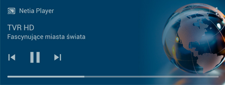
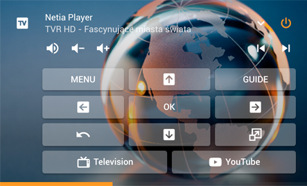

[](#)
[](#)
[](https://github.com/korasinski/ha-netia/releases)
[](https://www.buymeacoffee.com/korasinski)


# Custom component for Netia Player 
A platform which allows you to interact with the Netia Player TV box using HTTP API and `media_player` entity.

Currently supported device: _Netgem N7800 (Netia Player 2.0)_:


### Homekit TV supported!
The media player will show up as Television accessories on devices running iOS 12.2 or later

### Features
 - [X] Power on / power off
 - [X] Channel switching using prev/next buttons
 - [X] Volume control (+ mute function)
 - [X] Actual channel information (channel name, program title, episode info)
 - [X] Actual channel image artwork
 - [X] Progress bar with current channel
 - [X] Remote buttons support
 - [X] Application support
 - [ ] Translations
 - [ ] Configuration with auto discovery/UI configuration setup


## Screenshots

_Component can be used with default Home Assistant Media Player and [Mini Media Player](https://github.com/kalkih/mini-media-player) from [kalkih](https://github.com/kalkih/):_


_More details are displayed in the more-info view:_


## Installation

- Put the files from `/custom_components/netia_player/` in your HA config folder under `<config directory>/custom_components/netia_player/`
- Restart Home Assistant
- Configure new integration in `config.yaml`, see details below
- Restart Home Assistant again
- Add `netia_player` entity to the UI
- Reload UI and use new integration :) 

## Configuration
**Minimum configuration.yaml:**

```yaml
media_player:
  - platform: netia_player
    host: 192.168.1.5
```

**Configuration variables:**  

key | description  
:--- | :---  
**platform** _(Required)_ | The platform name `netia_player`
**host** _(Required)_ | The IP of the Netia Player, eg. `192.168.1.5`
**port** _(Optional)_ | The port of API in the Netia Player, default is `8080`
**app_support** _(Optional)_ | Application support (see details below), default is `False`
**app_list** _(Optional)_ | List of ID's of apps displayed in source select, default is `['tv']`
**name** _(Optional)_ | The name the device will have in Home Assistant, default is `Netia Player`

**Application support:**  
By default if `app_support` is False, source input list is not displayed on UI card. Only TV programs will be displayed in the component. 
When you switch it to `True` and not declare any `app_list` all avaliable applications in the device will be added to source input list.
You can overwrite this list by declaring your favorite apps in config. For this you need to add their ID's to `app_list`. Config entry will look like this:

```yaml
media_player:
  - platform: netia_player
    host: 192.168.1.5
    app_support: true
    app_list:
      - tv
      - youtube
      - ipla
      - tvnplayer
      - tvnmeteo
      - filmbox
      - hbogo
```

## Lovelace configuration
**Default media-control in ui-lovelace.yaml:**



```yaml
- type: media-control
  entity: media_player.netia_player
 ``` 
 
**Custom mini-media-player in ui-lovelace.yaml:**

[Basic card](https://github.com/kalkih/mini-media-player#basic-card):


```yaml
- type: custom:mini-media-player
  entity: media_player.netia_player
  artwork: cover
  volume_stateless: true
  hide:
    play_pause: true
    power_state: false  
```
[Compact card](https://github.com/kalkih/mini-media-player#compact-card) with cover artwork and remote buttons:



```yaml
- type: custom:mini-media-player
  entity: media_player.netia_player
  icon: mdi:television-box
  artwork: full-cover
  volume_stateless: true
  info: scroll
  source: icon
  background: "/local/img/netia-bg.jpg"
  hide:
    play_pause: true
    power_state: false
  shortcuts:
      columns: 3
      buttons:
        - name: MENU
          type: service
          id: media_player.play_media
          data:
            entity_id: media_player.netia_player
            media_content_id: 'menu'
            media_content_type: channel
        - icon: mdi:arrow-up-box
          type: service
          id: media_player.play_media
          data:
            entity_id: media_player.netia_player
            media_content_id: 'up'
            media_content_type: channel
        - name: GUIDE
          type: service
          id: media_player.play_media
          data:
            entity_id: media_player.netia_player
            media_content_id: 'guide'
            media_content_type: channel
        - icon: mdi:arrow-left-box
          type: service
          id: media_player.play_media
          data:
            entity_id: media_player.netia_player
            media_content_id: 'left'
            media_content_type: channel
        - name: OK
          type: service
          id: media_player.play_media
          data:
            entity_id: media_player.netia_player
            media_content_id: 'ok'
            media_content_type: channel
        - icon: mdi:arrow-right-box
          type: service
          id: media_player.play_media
          data:
            entity_id: media_player.netia_player
            media_content_id: 'right'
            media_content_type: channel
        - icon: mdi:undo
          type: service
          id: media_player.play_media
          data:
            entity_id: media_player.netia_player
            media_content_id: 'back'
            media_content_type: channel
        - icon: mdi:arrow-down-box
          type: service
          id: media_player.play_media
          data:
            entity_id: media_player.netia_player
            media_content_id: 'down'
            media_content_type: channel
        - icon: mdi:resize
          type: service
          id: media_player.play_media
          data:
            entity_id: media_player.netia_player
            media_content_id: 'fullscreen'
            media_content_type: channel
        - name: Television
          icon: mdi:television-classic
          type: service
          id: media_player.select_source
          data:
            entity_id: media_player.netia_player
            source: TV
        - name: YouTube
          icon: mdi:youtube
          type: service
          id: media_player.select_source
          data:
            entity_id: media_player.netia_player
            source: YouTube
```

## Services
As of v.0.1.0 two types of services are supported. You can call them using dev-tools or in any component (e.g. in media player). 

**Play media:**  
Send the media player the command for remote button press.
```yaml
- service: media_player.play_media
  entity_id: media_player.netia_player
  media_content_id: 'ok'        # see supported buttons below
  media_content_type: channel   # does not matter, required by HA
```
Supported buttons:  
`1, 2, 3, 4, 5, 6, 7, 8, 9, 0, on_off, mute, volume_up, volume_down, channel_up, channel_down, back, fullscreen, menu, up, down, left, right, ok, play, stop, prev, next, rec, guide, delete, red, green, yellow, blue`

**Select source:**  
Send the media player the command for opening application.
```yaml
- service: media_player.select_source
  entity_id: media_player.netia_player
  source: 'tv'  # see supported applications below
```
Supported apps:  
`tv, hbogo, kinoplex, ninateka, ipla, abcvod, premiumplus, npvr, goon, netiatvshop, psp, filmbox, tvnplayer, netiacloud, tubafm, tvnmeteo, tvpsport, pinkvision, erowizja, ksw, youtube, mediacenter`

There are internal apps like `epg` and `settings` which you can use in the service but they will not be included in source input list on UI.  

If you will open application that is not in your config it will be added to the source input list temporary  (till the next restart of HA). It may cause `Sources out of sync` warning described below.

_**NOTICE**: Some apps might be unavaliable in your subscription or are extra paid._

## Known issues
- If you are using Homekit integration you may see warnings like:
`WARNING (SyncWorker_4) [homeassistant.components.homekit.type_media_players] media_player.netia_player: Sources out of sync. Restart Home Assistant`
may appear. This issue will be fixed later. 
- `sync_get_media_image` error pops out when current channel image is not accessible at time of request. 


> <sup>All trademarks and registered trademarks presented in the pictures above are property of their respective owners.</sup><br>
> <sup><sup>Custom component based on <a href="https://github.com/custom-components/media_player.braviatv_psk">braviatv_psk</a><sup></sup>
