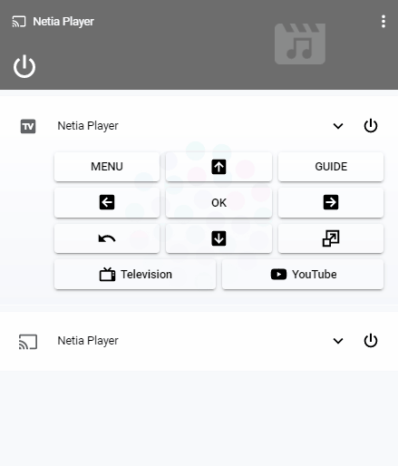
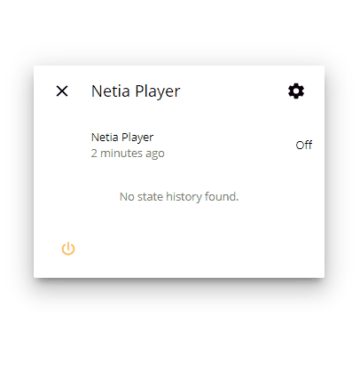

[](#)
[](#)
[](https://github.com/korasinski/ha-netia/releases)
[](https://www.buymeacoffee.com/korasinski)


# Custom component for Netia Player 
A platform which allows you to interact with the Netia Player TV box using HTTP API and `media_player` entity.

Currently supported device: _Netgem N7800 (Netia Player 2.0)_:


### Homekit TV supported!
The media player will show up as Television accessories on devices running iOS 12.2 or later

### Features
 - [X] Power on / power off
 - [X] Channel switching using prev/next buttons
 - [X] Volume control (+ mute function)
 - [X] Actual channel information (channel name, program title, episode info)
 - [X] Actual channel image artwork
 - [X] Progress bar with current channel
 - [ ] Remote button support
 - [ ] Application support
  


## Screenshots



_Component can be used with default Home Assistant Media Player and [Mini Media Player](https://github.com/kalkih/mini-media-player) from [kalkih](https://github.com/kalkih/)_



_More details is displayed on the card more-info view_

## Installation

Put the files from `/custom_components/netia/` in your config folder under `<config directory>/custom_components/netia/`

## Configuration
**Minimum configuration.yaml:**

```yaml
media_player:
  - platform: netia
    host: 192.168.1.5
```

**Configuration variables:**  

key | description  
:--- | :---  
**platform** _(Required)_ | The platform name `netia`
**host** _(Required)_ | The IP of the Netia Player, eg. `192.168.1.5`
**port** _(Optional)_ | The port of API in the Netia Player, default is `8080`
**name** _(Optional)_ | The name the device will have in Home Assistant, default is `Netia Player`


## Lovelace configuration
**Default media-control in ui-lovelace.yaml:**

```yaml
- type: media-control
  entity: media_player.netia_player
 ``` 
 
**Custom mini-media-player in ui-lovelace.yaml:**

[Basic card](https://github.com/kalkih/mini-media-player#basic-card):
```yaml
- type: custom:mini-media-player
  entity: media_player.netia_player
  artwork: cover
  volume_stateless: true
  hide:
    play_pause: true
    power_state: false  
```
[Compact card](https://github.com/kalkih/mini-media-player#compact-card):
```yaml
- type: custom:mini-media-player
  entity: media_player.netia_player
  artwork: cover
  volume_stateless: true
  hide:
    play_pause: true
    power_state: false 
    volume: true
```
- - - -
<sup>Custom component build based on [braviatv_psk](https://github.com/custom-components/media_player.braviatv_psk)</sup>
